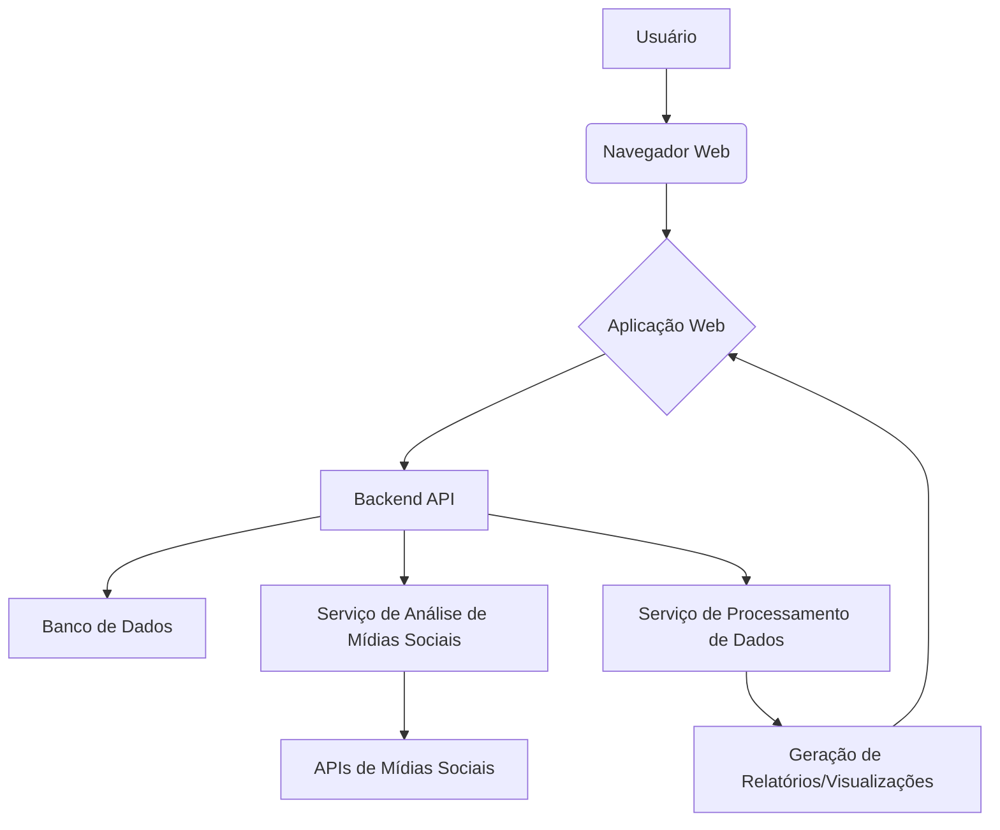
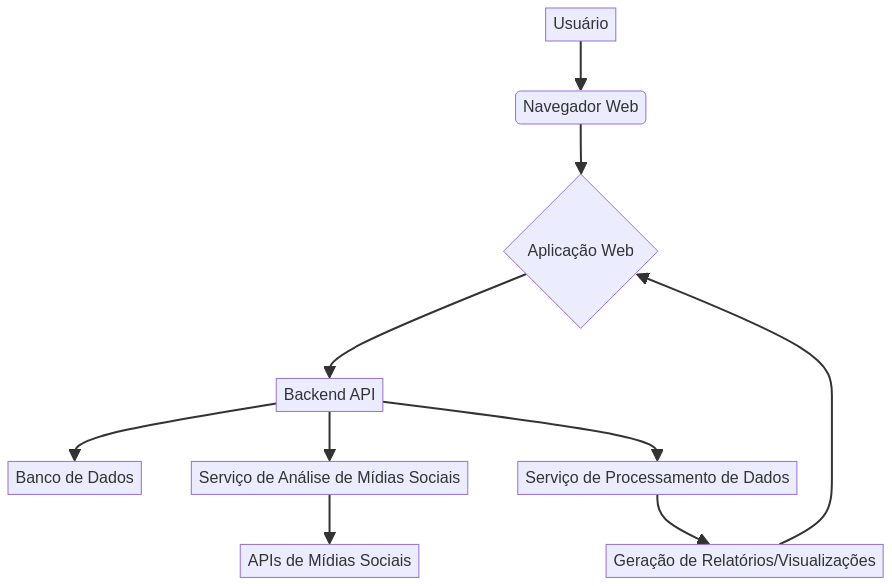

# Social-Media-Analytics-Tool


[](https://opensource.org/licenses/MIT)
[](https://www.python.org/)
[](https://pandas.pydata.org/)
[](https://numpy.org/)

## English

### 🚀 Overview

This **Social Media Analytics Tool** is a professional project developed by Gabriel Demetrios Lafis, showcasing advanced data science and software engineering skills. It provides comprehensive analytics for social media data, including sentiment tracking, trend analysis, and insightful visualizations. The tool is designed with a clean code architecture, modern development practices, and industry-standard implementations, making it suitable for professional portfolios and enterprise-grade applications.

### 🛠️ Technology Stack

The project leverages a robust set of technologies to deliver powerful social media analytics:

*   **Python**: Core programming language for data processing and analysis.
*   **Pandas**: Essential library for data manipulation and analysis.
*   **NumPy**: Fundamental package for numerical computing.
*   **Mermaid**: Used for generating architecture diagrams.

### ⚡ Features

*   **Professional Code Architecture**: Organized and modular codebase for maintainability and scalability.
*   **Comprehensive Data Analysis**: Advanced algorithms for sentiment analysis, trend detection, and statistical insights.
*   **Real-time Data Simulation**: Ability to simulate real-time data updates for dynamic analysis.
*   **Extensible Design**: Easily adaptable to integrate with various social media APIs.
*   **Well-documented Codebase**: Clear and concise documentation for easy understanding and collaboration.
*   **Unit Testing**: Robust unit tests ensuring code reliability and functionality.

### 🏗️ Architecture Diagram

The following diagram illustrates the high-level architecture of the Social Media Analytics Tool:





### 🏃‍♂️ Quick Start

To get started with the Social Media Analytics Tool, follow these steps:

1.  **Clone the repository:**

    ```bash
    git clone https://github.com/galafis/Social-Media-Analytics-Tool.git
    cd Social-Media-Analytics-Tool
    ```

2.  **Install dependencies:**

    ```bash
    pip install -r requirements.txt
    ```

3.  **Run the application:**

    ```bash
    python src/main.py
    ```

### 📦 Installation & Setup

Detailed instructions for setting up the development environment and deploying the application:

1.  **Prerequisites:**
    *   Python 3.9+
    *   `pip` (Python package installer)

2.  **Virtual Environment (Recommended):**

    ```bash
    python -m venv venv
    source venv/bin/activate  # On Windows, use `venv\Scripts\activate`
    ```

3.  **Install Dependencies:**

    ```bash
    pip install -r requirements.txt
    ```

### 🎯 Use Cases

*   **Professional Development Portfolio**: A prime example of clean code, robust architecture, and comprehensive documentation.
*   **Learning Modern Python Practices**: Ideal for developers looking to understand advanced Python, Pandas, and NumPy applications.
*   **Code Reference and Examples**: Serves as a reference for implementing data analysis and social media integration.
*   **Enterprise-grade Implementations**: Demonstrates patterns suitable for large-scale data processing and analytics.

### 📊 Project Structure

```
Social-Media-Analytics-Tool/
├── .github/              # GitHub specific configurations (e.g., workflows)
├── docs/                 # Documentation files, diagrams, and assets
│   └── architecture_diagram.mmd
│   └── architecture_diagram.png
├── src/                  # Source code for the main application logic
│   └── main.py
├── tests/                # Unit tests for the application
│   └── test_analytics.py
├── config/               # Configuration files (if any)
├── .gitignore            # Specifies intentionally untracked files to ignore
├── LICENSE               # Project license (MIT License)
├── README.md             # This README file
└── requirements.txt      # Python dependencies
```

### 🤝 Contributing

Contributions are welcome! Please feel free to submit a Pull Request or open an issue.

### 📄 License

This project is licensed under the MIT License - see the [LICENSE](LICENSE) file for details.

### 👨‍💻 Author

**Gabriel Demetrios Lafis**

*   Data Scientist & Engineer
*   Systems Developer & Analyst
*   Cybersecurity Specialist

--- 

## Português

### 🚀 Visão Geral

Esta **Ferramenta de Análise de Mídias Sociais** é um projeto profissional desenvolvido por Gabriel Demetrios Lafis, demonstrando habilidades avançadas em ciência de dados e engenharia de software. Ela oferece análises abrangentes para dados de mídias sociais, incluindo rastreamento de sentimento, análise de tendências e visualizações perspicazes. A ferramenta é projetada com uma arquitetura de código limpa, práticas de desenvolvimento modernas e implementações padrão da indústria, tornando-a adequada para portfólios profissionais e aplicações de nível empresarial.

### 🛠️ Stack Tecnológica

O projeto utiliza um conjunto robusto de tecnologias para fornecer análises poderosas de mídias sociais:

*   **Python**: Linguagem de programação principal para processamento e análise de dados.
*   **Pandas**: Biblioteca essencial para manipulação e análise de dados.
*   **NumPy**: Pacote fundamental para computação numérica.
*   **Mermaid**: Usado para gerar diagramas de arquitetura.

### ⚡ Funcionalidades

*   **Arquitetura de Código Profissional**: Base de código organizada e modular para manutenibilidade e escalabilidade.
*   **Análise Abrangente de Dados**: Algoritmos avançados para análise de sentimento, detecção de tendências e insights estatísticos.
*   **Simulação de Dados em Tempo Real**: Capacidade de simular atualizações de dados em tempo real para análise dinâmica.
*   **Design Extensível**: Facilmente adaptável para integrar com várias APIs de mídias sociais.
*   **Base de Código Bem Documentada**: Documentação clara e concisa para fácil compreensão e colaboração.
*   **Testes Unitários**: Testes unitários robustos garantindo a confiabilidade e funcionalidade do código.

### 🏗️ Diagrama de Arquitetura

O diagrama a seguir ilustra a arquitetura de alto nível da Ferramenta de Análise de Mídias Sociais:


### 🏃‍♂️ Início Rápido

Para começar a usar a Ferramenta de Análise de Mídias Sociais, siga estes passos:

1.  **Clone o repositório:**

    ```bash
    git clone https://github.com/galafis/Social-Media-Analytics-Tool.git
    cd Social-Media-Analytics-Tool
    ```

2.  **Instale as dependências:**

    ```bash
    pip install -r requirements.txt
    ```

3.  **Execute a aplicação:**

    ```bash
    python src/main.py
    ```

### 📦 Instalação e Configuração

Instruções detalhadas para configurar o ambiente de desenvolvimento e implantar a aplicação:

1.  **Pré-requisitos:**
    *   Python 3.9+
    *   `pip` (instalador de pacotes Python)

2.  **Ambiente Virtual (Recomendado):**

    ```bash
    python -m venv venv
    source venv/bin/activate  # No Windows, use `venv\Scripts\activate`
    ```

3.  **Instale as Dependências:**

    ```bash
    pip install -r requirements.txt
    ```

### 🎯 Casos de Uso

*   **Portfólio de Desenvolvimento Profissional**: Um excelente exemplo de código limpo, arquitetura robusta e documentação abrangente.
*   **Aprendizado de Práticas Modernas em Python**: Ideal para desenvolvedores que desejam entender aplicações avançadas de Python, Pandas e NumPy.
*   **Referência de Código e Exemplos**: Serve como referência para implementar análise de dados e integração de mídias sociais.
*   **Implementações de Nível Empresarial**: Demonstra padrões adequados para processamento e análise de dados em larga escala.

### 📊 Estrutura do Projeto

```
Social-Media-Analytics-Tool/
├── .github/              # Configurações específicas do GitHub (ex: workflows)
├── docs/                 # Arquivos de documentação, diagramas e ativos
│   └── architecture_diagram.mmd
│   └── architecture_diagram.png
├── src/                  # Código-fonte para a lógica principal da aplicação
│   └── main.py
├── tests/                # Testes unitários para a aplicação
│   └── test_analytics.py
├── config/               # Arquivos de configuração (se houver)
├── .gitignore            # Especifica arquivos intencionalmente não rastreados a serem ignorados
├── LICENSE               # Licença do projeto (Licença MIT)
├── README.md             # Este arquivo README
└── requirements.txt      # Dependências Python
```

### 🤝 Contribuindo

Contribuições são bem-vindas! Sinta-se à vontade para enviar um Pull Request ou abrir uma issue.

### 📄 Licença

Este projeto está licenciado sob a Licença MIT - veja o arquivo [LICENSE](LICENSE) para detalhes.

### 👨‍💻 Autor

**Gabriel Demetrios Lafis**

*   Cientista e Engenheiro de Dados
*   Desenvolvedor e Analista de Sistemas
*   Especialista em Segurança Cibernética

