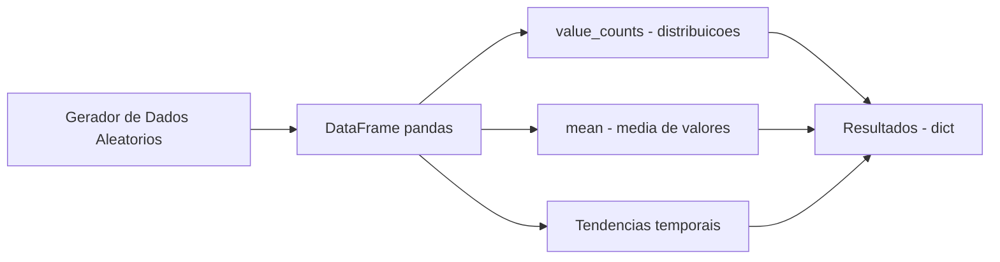
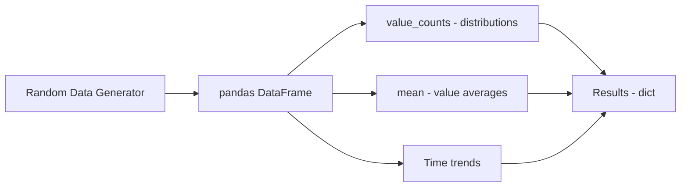

# Social Media Analytics Tool

Ferramenta simples de analise de dados sinteticos com pandas.

[](https://python.org)
[](https://pandas.pydata.org)
[](LICENSE)

[English](#english) | [Portugues](#portugues)

---

## Portugues

### Visao Geral

Script Python que gera dados sinteticos simulando metricas de midias sociais e calcula estatisticas descritivas basicas usando pandas. Os dados sao gerados aleatoriamente — nao ha integracao com APIs reais de midias sociais.

### Arquitetura



### Funcionalidades

- **Geracao de dados sinteticos** — 1000 registros com timestamp, valor, categoria, status e sentimento
- **Estatisticas descritivas** — media de valores, distribuicoes por categoria/status/sentimento
- **Tendencias temporais** — media de valores por data
- **Exportacao** — resultados como dicionario Python

### Como Executar

```bash
# Instalar dependencias
pip install -r requirements.txt

# Executar analise
python src/main.py

# Executar testes
pytest tests/test_analytics.py -v
```

### Estrutura do Projeto

```
Social-Media-Analytics-Tool/
├── src/
│   ├── __init__.py
│   └── main.py                # Script principal (~104 linhas)
├── tests/
│   ├── __init__.py
│   └── test_analytics.py      # Testes unitarios
├── .gitignore
├── LICENSE
├── README.md
└── requirements.txt
```

### Tecnologias

| Tecnologia | Uso |
|------------|-----|
| Python | Linguagem principal |
| pandas | Manipulacao de dados |
| NumPy | Geracao de numeros aleatorios |

### Limitacoes

- Nao conecta com APIs reais de midias sociais
- Nao possui visualizacao, exportacao para arquivo, ou interface web
- Dados sao inteiramente sinteticos/aleatorios

---

## English

### Overview

Python script that generates synthetic data simulating social media metrics and computes basic descriptive statistics using pandas. Data is randomly generated — there is no integration with real social media APIs.

### Architecture



### Features

- **Synthetic data generation** — 1000 records with timestamp, value, category, status, and sentiment
- **Descriptive statistics** — value averages, distributions by category/status/sentiment
- **Time trends** — value averages by date
- **Export** — results as Python dictionary

### How to Run

```bash
# Install dependencies
pip install -r requirements.txt

# Run analysis
python src/main.py

# Run tests
pytest tests/test_analytics.py -v
```

### Project Structure

```
Social-Media-Analytics-Tool/
├── src/
│   ├── __init__.py
│   └── main.py                # Main script (~104 lines)
├── tests/
│   ├── __init__.py
│   └── test_analytics.py      # Unit tests
├── .gitignore
├── LICENSE
├── README.md
└── requirements.txt
```

### Technologies

| Technology | Usage |
|------------|-------|
| Python | Core language |
| pandas | Data manipulation |
| NumPy | Random number generation |

### Limitations

- Does not connect to any real social media APIs
- No visualization, file export, or web interface
- Data is entirely synthetic/random

---

**Autor / Author:** Gabriel Demetrios Lafis
- GitHub: [@galafis](https://github.com/galafis)
- LinkedIn: [Gabriel Demetrios Lafis](https://linkedin.com/in/gabriel-demetrios-lafis)
